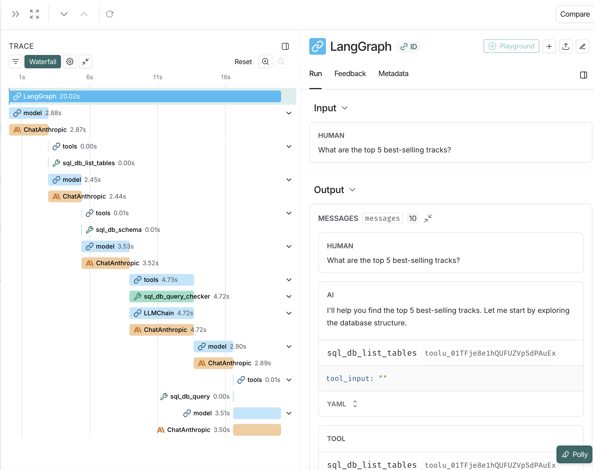

# Text-to-SQL Agent

Ask a database questions in plain English and get real answers back. You type
something like *"which employee generated the most revenue?"* and the agent
pokes around the schema, writes the SQL, sanity-checks it, runs it, and tells
you what it found. It's built on LangChain's `create_agent` with Gemini
(3.6 Flash by default) doing the thinking.

## What it does

- Turns plain-English questions into working SQL
- Figures out the schema itself before writing anything
- Checks each query for syntax and safety, and rewrites it when the database
  complains — up to three tries by default, then it stops and reports the error
  instead of looping forever
- Handles the awkward stuff: JOINs, aggregations, subqueries
- Won't run anything destructive — no INSERT, UPDATE, DELETE, or DROP
- Traces every run in LangSmith if you've set that up
- Comes with a notebook that walks through the whole build

## The database

I test against the [Chinook database](https://github.com/lerocha/chinook-database) —
a fake digital music store with the usual artists, albums, tracks, customers,
and invoices. Any SQLite file works, though; just point the connection string
somewhere else.

## Getting started

### You'll need

- Python 3.11 or newer
- A Google AI Studio API key — grab one free at
  [aistudio.google.com/apikey](https://aistudio.google.com/apikey) (no card needed)
- Optionally, a LangSmith key if you want tracing ([sign up](https://smith.langchain.com/))

### Setup

Clone it:
```bash
git clone https://github.com/axololtos/text-to-sql-agent.git
cd text-to-sql-agent
```

Pull down the Chinook database:
```bash
curl -L -o chinook.db https://github.com/lerocha/chinook-database/raw/master/ChinookDatabase/DataSources/Chinook_Sqlite.sqlite
```

Set up an environment and install. I use uv:
```bash
uv venv --python 3.11
source .venv/bin/activate  # Windows: .venv\Scripts\activate
uv pip install -e .
```

Plain pip is fine too:
```bash
python3.11 -m venv .venv
source .venv/bin/activate
pip install -e .
```

Then add your keys:
```bash
cp .env.example .env
# open .env and fill it in
```

The only required line is:
```
GOOGLE_API_KEY=your_google_ai_studio_key_here
```

If you want LangSmith tracing:
```
LANGCHAIN_TRACING_V2=true
LANGSMITH_ENDPOINT=https://api.smith.langchain.com
LANGCHAIN_API_KEY=your_langsmith_api_key_here
LANGCHAIN_PROJECT=text2sql-agent
```

## Using it

### From the command line

```bash
python agent.py "What are the top 5 best-selling artists?"
python agent.py "Which employee generated the most revenue?"
python agent.py "How many customers are from Canada?"
```

Add `--max-repair-attempts N` to give it more (or fewer) shots at fixing a
broken query:
```bash
python agent.py "..." --max-repair-attempts 5
```

### From the notebook

```bash
jupyter notebook tutorial.ipynb
```

The notebook builds the agent step by step and runs a few example questions,
plus LangSmith setup and a schema cheat sheet.

## How it works

Every run goes through roughly the same steps:

1. **Look around** — list the tables
2. **Read the schema** — columns and a few sample rows for the tables that matter
3. **Write the query** — Gemini drafts the SQL
4. **Check it** — a second pass for syntax and for anything destructive
5. **Run it**
6. **Fix and retry** — if the database throws an error, the exact message goes
   back to the agent so it can correct the query. That repeats up to
   `--max-repair-attempts` times (three by default); after that the agent gives
   up and reports the last error rather than spinning.
7. **Answer** — hand back something readable

The system prompt is what forces steps 1 and 2 to happen first, keeps result
sets capped at `top_k`, and blocks DML.

## LangSmith tracing

With LangSmith wired up, every run shows up with the full tool-call trace,
token counts and cost, timing, the SQL it generated, and any retries it went
through.



## Configuration

The things I actually change, all in `agent.py`:

```python
# how many sample rows the agent sees per table
db = SQLDatabase.from_uri("sqlite:///chinook.db", sample_rows_in_table_info=3)

# default cap on rows returned, dropped into the system prompt
system_prompt=SYSTEM_PROMPT.format(dialect=db.dialect, top_k=5)
```

The repair budget you can set without touching code — either
`--max-repair-attempts` on the command line or `MAX_REPAIR_ATTEMPTS` in `.env`
(the flag wins if both are set).

## Layout

```
text-to-sql-agent/
├── agent.py           # the agent and the CLI
├── tutorial.ipynb     # walkthrough notebook
├── tests/             # plain-assert checks, no framework
├── chinook.db         # sample database (gitignored)
├── pyproject.toml     # deps and config
├── uv.lock            # locked versions
├── .env.example       # env template
└── README.md
```

## Dependencies

The full list lives in `pyproject.toml`:

- langchain
- langchain-google-genai
- langchain-community
- langgraph
- sqlalchemy
- python-dotenv
- rich

## License

MIT

## Thanks

- [LangChain](https://www.langchain.com/)
- [Chinook Database](https://github.com/lerocha/chinook-database)
- [LangSmith](https://smith.langchain.com/)
